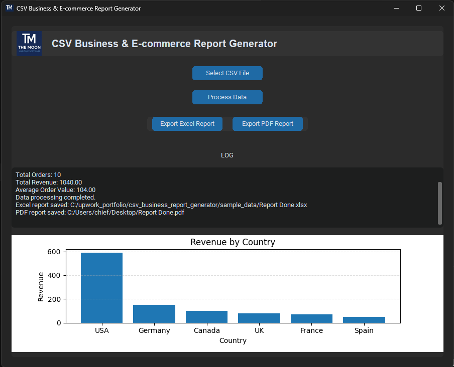

# CSV Business & E-commerce Report Generator

Python desktop GUI application for analyzing CSV sales data and generating business reports.

## Features

• Load CSV sales data  
• Calculate revenue statistics  
• Generate business analytics  
• Interactive chart visualization  
• Export Excel reports with charts  
• Export PDF reports  
• Clean GUI built with CustomTkinter  

## Technologies

Python  
Pandas  
CustomTkinter  
Matplotlib  
ReportLab  
XlsxWriter  

## Example Workflow

1. Select CSV file
2. Process data
3. View analytics
4. Export Excel report
5. Export PDF report

## Screenshot

## Example Use Cases

• E-commerce analytics  
• Shopify / Amazon sales reports  
• Business CSV automation  
• Data reporting tools

## Installation

1. Clone the repository

git clone https://github.com/sergejs-dev/csv-business-report-generator.git

2. Install dependencies

pip install -r requirements.txt

3. Run application

python main.py

Works with any CSV exported from:
• Shopify
• Amazon
• WooCommerce
• other e-commerce platforms
